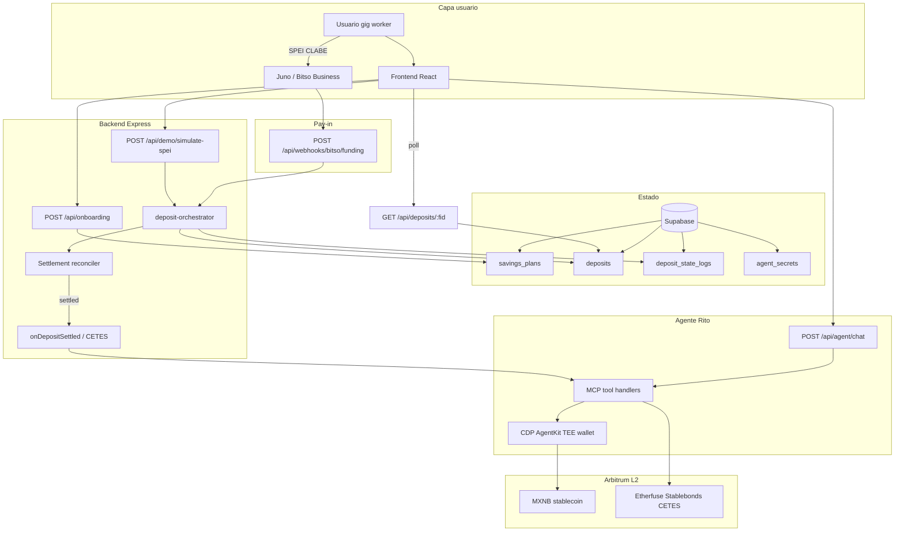

# Arquitectura — Rito · Retiro Inteligente LATAM

Documentación técnica para revisión de código (ETHMX 2026 · AI & Agentic Finance).

**Demo:** https://retiro-inteligente-latam.vercel.app  
**Monorepo:** `frontend/` (Vite/React) + `backend/` (Express/TypeScript) desplegados en Vercel con `experimentalServices`.

---

## Diagrama del sistema



### Flujo de capas (vista simplificada)

```
Usuario gig  →  Juno Webhook  →  Supabase  →  Reconciliador  →  Rito + MCP  →  Arbitrum
   SPEI/CLABE     Bitso Business   deposits+logs   polling 60s      CDP AgentKit    MXNB→CETES
```

---

## Pipeline de depósito (producción)

```text
SPEI → POST /api/webhooks/bitso/funding
     → deposits.status: pending → processing
     → settlement-processor (exponential backoff + jitter)
     → onDepositSettled() → purchase_stablebond (MCP)
     → deposits.status: invested
     → GET /api/deposits/:fid (ui.phase: 3 "Invertido")
```

## Pipeline demo (hackathon)

```text
POST /api/onboarding              → plan + CLABE + wallet_address
POST /api/demo/simulate-spei      → crea depósito + pipeline async
GET  /api/deposits/:fid           → polling UI stepper (1.5s)
```

---

## Modos de operación

| Modo | Variable | Comportamiento |
|------|----------|----------------|
| On-chain sandbox | `ONCHAIN_SANDBOX_MODE=true` | Simula mint MXNB + compra CETES sin CDP |
| Chat sandbox | `AGENT_CHAT_SANDBOX_MODE=true` | Rito responde con reglas + MCP sin OpenAI |
| Producción | CDP + Juno + Etherfuse + Supabase | Transacciones y settlement reales |

---

## Seguridad del monedero agéntico

| Mecanismo | Implementación |
|-----------|----------------|
| Custodia | CDP AgentKit — el usuario no maneja seed |
| Cifrado | Export wallet AES-256-GCM (`WALLET_MASTER_KEY`) |
| Persistencia Vercel | Tabla `agent_secrets` en Supabase (filesystem efímero en serverless) |
| TEE policies | Whitelist MXNB + Etherfuse; límite 500 MXNB/día |
| Ledger gasto | Tabla `wallet_daily_spend` |

---

## Herramientas MCP (agente)

El LLM **nunca** accede a la clave privada — solo invoca tools registradas en `backend/src/mcp/tools/handlers.ts`:

| Tool | Función |
|------|---------|
| `get_wallet_details` | Dirección y red del monedero TEE |
| `get_balance` | Balance MXNB |
| `transfer` | Transferencia con policy TEE |
| `quote_stablebond` | Cotización CETES (Etherfuse) |
| `purchase_stablebond` | Compra CETES tokenizados |
| `project_retirement_fund` | Proyección vs AFORE (~7.84%) |
| `get_savings_plan` | Plan + CLABE |
| `update_savings_plan` | Actualizar micro-ahorro |

Servidor stdio: `npm run mcp -w backend` · Config: `mcp.json`

---

## Resiliencia SPEI

| Mecanismo | Detalle |
|-----------|---------|
| Idempotencia | `fid` único por depósito |
| ACK rápido | Webhook 200 + procesamiento background |
| Backoff | Polling Juno configurable (`SETTLEMENT_*`) |
| Reconciler | Job cada 60s para depósitos atascados (dev; omitido en serverless) |
| Auditoría | `deposit_state_logs.metadata.providerAudit` |
| Reintento | `POST /api/deposits/:fid/retry` |

---

## Estructura del repositorio

```text
├── backend/
│   ├── src/agent.ts              # CDP AgentKit init + TEE policy
│   ├── src/mcp/                  # MCP server + tool handlers
│   ├── src/services/             # Settlement, CETES, wallet, Supabase repos
│   ├── src/controllers/          # HTTP handlers
│   ├── src/db/migrations/        # SQL incremental (004–006)
│   └── scripts/verify-*.ts       # verify:supabase, verify:openai, verify:wallet
├── frontend/
│   ├── src/pages/                # Landing, Onboarding, AgentChat
│   └── src/components/           # WalletPanel, DepositStatusStepper, Rito DS
├── vercel.json                   # Monorepo frontend + backend /api
├── ARCHITECTURE.md               # Este documento
└── README.md                     # Pitch + tabla de API
```

---

## Desarrollo local

```bash
cp .env.example .env
npm install
npm run dev                    # frontend :5173 + backend :3001
npm run verify:supabase -w backend
npm run verify:wallet -w backend
```

Migraciones Supabase: ejecutar `backend/src/db/schema.sql` y `backend/src/db/migrations/*.sql` en el SQL Editor.
